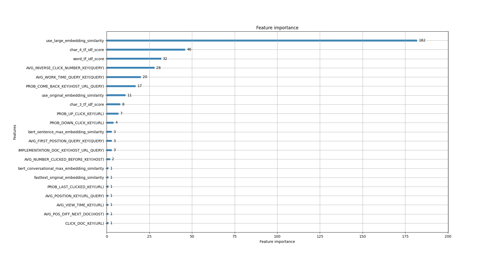
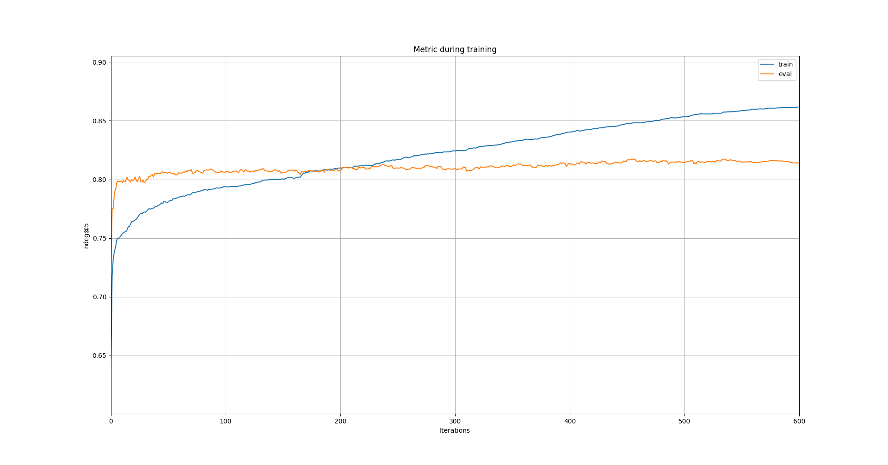

# Семестровый проект
Репозиторий семестрового проекта дисциплины "Инфопоиск" на курсах [Техносфера](https://sphere.mail.ru/). 

Задание выполнил *Кононов Сергей, группа BD-31* весной 2020 года.

Код расположен в директории */src*. В файле */presentation.pdf* находится презентация проекта. В файле */guideline.pdf* находится рекомендованный план решения. В фале */sheme.png* находится схема взаимодействия компонентов системы. Все необходимые данные находянтся в на [Google Drive](https://drive.google.com/drive/folders/1dZnvVXvRYJ2MmpGnDWVZ3y6J42fUEZnV?usp=sharing).

На рисунке приведён график важности признаков.


На рисунке приведён график обучения модели при разбиении train/validation равном 80/20.



Для тестирования кода предлагаются следующие сценарии:

* Запуск LightGBM на готовом датасете
* Предобработку текстов запросов и заголовков документов
* Подсчёт синтаксических признаков
* Посчёт семантических признаков
* Соединение кликовых, синтаксических и семантических данных  

### Запуск LightGBM на готовом датасете.

Для выполнения этого необходимо запустить файл */script_1.sh*:

```
bash ./script_1.sh
```

Данный скрипты выполняет следующую последовательность действий:

1. Загрузка данных из [облака](https://drive.google.com/drive/folders/1dZnvVXvRYJ2MmpGnDWVZ3y6J42fUEZnV?usp=sharing) в */data*
2. Обучение ранажирующей модели
3. Подсчёт результатов для тестовой выборки 
4. Сохранение результата в */resutl.csv*

Необходимые требования:

* python3.6
* lightgbm
* matplotib

### Предобработка текстов.

Для выполнения этого необходимо запустить файл */script_2.sh*

```
bash ./script_2.sh
```

Данный скрипты выполняет следующую последовательность действий:

1. Загрузка данных из [облака](https://drive.google.com/drive/folders/1dZnvVXvRYJ2MmpGnDWVZ3y6J42fUEZnV?usp=sharing) в */data*
2. Применение 
    1.  Понижение регистра
    2.  Исправеление опечаток
    3.  Лемматизация
    4.  Токенизация
3. Сохранение результата в */data*

Необходимые требования:

* request
* sklearn
* pymystem3

### Сценарий подсчёта синтаксических признаков.

Для выполнения этого необходимо запустить файл */script_3.sh*

```
bash ./script_3.sh
```

Данный скрипты выполняет следующую последовательность действий:

1. Загрузка данных из [облака](https://drive.google.com/drive/folders/1dZnvVXvRYJ2MmpGnDWVZ3y6J42fUEZnV?usp=sharing) в */data*
2. Создание словаря
3. Преобразование корпуса в корпус из предложений типа bag-of-words
4. Подсчёт статистик для моделей TF-IDF и BM-25 (по словам, парам слов, 3-граммам и 4-граммам)
5. Подсчёт занчение TF-IDF и BM-25
3. Сохранение результата в */data*

Необходимые требования:

* request
* sklearn

### Сценарий подсчёта семантических признаков признаков.

Код расположен в директории */src/python/*.

В виду высокой ресурсоёмкости вычислений, рекомендуется перейти по ссылкам на Google Colab и запускать код там. 

1. BERT в [Googel Colab](https://colab.research.google.com/drive/1hpG6UB5Y8awifB2SMldcHlIndQXOclpu#scrollTo=rBNwamZCTVmW) и в файле */src/python/BERT.ipynb*
2. FastText в [Google Colab](https://colab.research.google.com/drive/1ZSLONizMuQIPHfgEFvSApPjb04wzbr_O?usp=sharing) и в файле */src/python/FastText.ipynb*
3. USE в [Google Colab](https://colab.research.google.com/drive/1bayelVP4itrYqcda9jl_ftAwK8fLu8LZ#scrollTo=MSeY-MUQo2Ha) и в файле */src/python/USE.ipynb*
4. ELMo в [Google Colab](https://colab.research.google.com/drive/1lUja4LSUr-alI6G1e8McEGXBdhuIv4wQ#scrollTo=HKYg8fMZ8p3V) и в файле */src/python/ELMo.ipynb*


### Сценарий соединения кликовых, синтаксические и семантические данных

Для выполнения этого необходимо запустить файл */script_4.sh*

```
bash ./script_4.sh
```

Данный скрипты выполняет следующую последовательность действий:

1. Загрузка данных из [облака](https://drive.google.com/drive/folders/1dZnvVXvRYJ2MmpGnDWVZ3y6J42fUEZnV?usp=sharing) в */data*
2. Конкатенация таблиц признаков
3. Сохранение результата в */data*